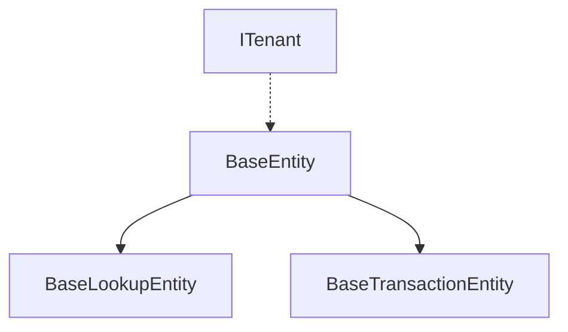

# Entity Çakışma Analiz Raporu

## 1. Tespit Edilen Sorunlar

### 1.1 Entity Lokasyon Çakışmaları

#### A. KBS (Kimlik Bildirim Sistemi) Entity'leri
| Dosya Yolu | İçerik Tipi | Bağımlılıklar |
|------------|-------------|----------------|
| Core/Models/KBS/KbsNotification.cs | Entity | BaseEntity |
| Core/Models/Integration/KbsNotification.cs | Entity | BaseEntity |
| Core/Entities/Kbs/KbsNotification.cs | Entity + ITenant | BaseEntity, ITenant |

**Potansiyel Etkiler:**
- Entity Framework migration'larında karışıklık
- Repository pattern implementasyonlarında yanlış entity kullanımı
- Dependency Injection container'da belirsizlik
- KBS entegrasyonunda veri tutarsızlığı riski

#### B. Rol/Yetki Entity'leri
| Dosya Yolu | İçerik Tipi | Bağımlılıklar |
|------------|-------------|----------------|
| Core/Entities/Identity/Role.cs | BaseLookupEntity | BaseLookupEntity |
| Core/Entities/Identity/Rol.cs | BaseEntity | BaseEntity |
| Core/Entities/Identity/RolePermission.cs | BaseEntity | BaseEntity |
| Core/Entities/Identity/RolYetki.cs | BaseEntity | BaseEntity |

**Potansiyel Etkiler:**
- Yetkilendirme sisteminde tutarsızlık
- Kullanıcı rolleri ve izinlerinde karışıklık
- Çift kayıt riski

#### C. Servis Entity'leri
| Dosya Yolu | İçerik Tipi | Bağımlılıklar |
|------------|-------------|----------------|
| Core/Models/Services/ServiceRequest.cs | Entity | BaseEntity |
| Core/Entities/Services/ServiceRequest.cs | Entity | BaseEntity |
| Core/Entities/ServiceRequest.cs | Entity + Alt Entity'ler | BaseEntity |

**Potansiyel Etkiler:**
- Servis takibinde veri kaybı riski
- Yanlış servis kaydı oluşturma
- Raporlamada tutarsızlık

### 1.2 Base Entity Hiyerarşisi Karmaşası



**Mevcut Kullanım:**
- BaseEntity: Temel CRUD özellikleri
- BaseLookupEntity: Referans tablo özellikleri
- BaseTransactionEntity: İşlem kayıtları
- ITenant: Multi-tenant özellikler

**Sorunlar:**
1. Bazı entity'ler yanlış base sınıfı kullanıyor
2. ITenant interface'i tutarsız kullanılıyor
3. Audit özellikleri farklı implementasyonlarda

## 2. Etki Analizi

### 2.1 Doğrudan Etkilenen Bileşenler

1. **Veritabanı Katmanı**
   - Entity Framework DbContext'ler
   - Migration'lar
   - Repository implementasyonları

2. **Servis Katmanı**
   - Business logic servisleri
   - Validation servisleri
   - AutoMapper profilleri

3. **API Katmanı**
   - Controller'lar
   - DTO mapping'leri
   - Response modeller

### 2.2 Dolaylı Etkilenen Bileşenler

1. **Frontend Entegrasyonu**
   - API çağrıları
   - Model binding
   - Form validasyonları

2. **Raporlama Sistemi**
   - Veri tutarsızlığı
   - Yanlış ilişkiler
   - Eksik veriler

3. **Güvenlik ve Yetkilendirme**
   - Role-based access control
   - Policy-based authorization
   - Multi-tenant izolasyon

## 3. Çözüm Stratejisi

### 3.1 Acil Eylem Planı

1. **Entity Konsolidasyonu**
   ```markdown
   - [x] Tüm entity'leri Core/Entities altında topla
   - [ ] Alt domain'lere göre klasörleme yap
   - [ ] Naming convention standardı belirle
   - [ ] XML documentation ekle
   ```

2. **Base Entity Düzenlemesi**
   ```markdown
   - [ ] BaseEntity'yi güncelle
   - [ ] ITenant implementasyonunu standardize et
   - [ ] Audit özelliklerini merkezi hale getir
   ```

3. **Migration Yönetimi**
   ```markdown
   - [ ] Mevcut migration'ları yedekle
   - [ ] Yeni base migration oluştur
   - [ ] Data migration script'leri hazırla
   ```

### 3.2 Uzun Vadeli İyileştirmeler

1. **Kod Kalitesi**
   - Entity validation kuralları
   - Unit test coverage
   - Integration test senaryoları

2. **Dokümantasyon**
   - API documentation
   - Entity relationship diagramları
   - Migration kılavuzu

3. **Monitoring**
   - Performance metrics
   - Error logging
   - Audit trailing

## 4. Detaylı Çözüm Adımları

### 4.1 Entity Konsolidasyonu

```csharp
// Örnek: Konsolide edilmiş KbsNotification entity'si
namespace ResidenceManagement.Core.Entities.Kbs
{
    /// <summary>
    /// KBS bildirim entity'si
    /// </summary>
    public class KbsNotification : BaseEntity, ITenant
    {
        // Temel özellikler
        public int FirmaId { get; set; }
        public int SubeId { get; set; }
        
        // KBS özellikleri
        public string NotificationNumber { get; set; }
        public DateTime NotificationDate { get; set; }
        public KbsNotificationStatus Status { get; set; }
        
        // Navigation properties
        public virtual Firma Firma { get; set; }
        public virtual Sube Sube { get; set; }
    }
}
```

### 4.2 Migration Stratejisi

```sql
-- Örnek: Veri Birleştirme Script'i
BEGIN TRANSACTION;

-- Eski tablolardan veri taşıma
INSERT INTO dbo.KbsNotifications (
    FirmaId, SubeId, NotificationNumber, 
    NotificationDate, Status, CreatedDate, 
    CreatedBy, IsDeleted
)
SELECT 
    FirmaId, SubeId, NotificationNo,
    NotificationDate, Status, CreatedDate,
    CreatedBy, IsDeleted
FROM dbo.OldKbsNotifications
WHERE NOT EXISTS (
    SELECT 1 
    FROM dbo.KbsNotifications k 
    WHERE k.NotificationNumber = OldKbsNotifications.NotificationNo
);

COMMIT TRANSACTION;
```

## 5. Risk Yönetimi

### 5.1 Potansiyel Riskler

1. **Veri Kaybı Riskleri**
   - Mükerrer kayıtlar
   - İlişkisel bütünlük
   - Transaction yönetimi

2. **Performans Riskleri**
   - Query optimizasyonu
   - Index stratejisi
   - Bulk operasyonlar

3. **Uygulama Riskleri**
   - Servis kesintisi
   - Hatalı veri gösterimi
   - API uyumsuzluğu

### 5.2 Risk Azaltma Stratejileri

1. **Veri Güvenliği**
   - Yedekleme planı
   - Rollback stratejisi
   - Veri doğrulama testleri

2. **Deployment Stratejisi**
   - Aşamalı geçiş
   - Blue-green deployment
   - Feature toggle kullanımı

3. **Monitoring ve Alerting**
   - Error tracking
   - Performance monitoring
   - User feedback collection

## 6. Zaman Planlaması

### 6.1 Kısa Vadeli (1-2 Hafta)
- Entity analizi ve dökümantasyon
- Test ortamında POC
- Kritik servislerin düzenlenmesi

### 6.2 Orta Vadeli (2-4 Hafta)
- Entity konsolidasyonu
- Migration script'leri
- Test coverage artırımı

### 6.3 Uzun Vadeli (1-2 Ay)
- Tam sistem testi
- Production deployment
- Monitoring ve optimizasyon

## 7. Başarı Kriterleri

1. **Teknik Kriterler**
   - Tüm testlerin başarılı çalışması
   - Performance metrics'lerin kabul edilebilir seviyede olması
   - Zero downtime deployment

2. **İş Kriterleri**
   - Kullanıcı işlemlerinin kesintisiz devam etmesi
   - Raporlamaların doğru çalışması
   - Sistem stabilitesinin korunması

## 8. Sonuç ve Öneriler

Bu entity çakışma sorunu, projenin temel yapıtaşlarını etkileyen ciddi bir teknik borçtur. Çözüm sürecinde:

1. Öncelikle entity'lerin konsolidasyonu
2. Sonra migration stratejisinin uygulanması
3. Son olarak dependent servislerin güncellenmesi

şeklinde ilerlenmelidir.

**Öneriler:**
- Code review sürecinin güçlendirilmesi
- Automated testing altyapısının geliştirilmesi
- Continuous Integration süreçlerinin iyileştirilmesi
- Entity framework best practices'lerinin dokümante edilmesi

Bu rapor, projenin sağlıklı bir şekilde ilerleyebilmesi için gerekli adımları ve dikkat edilmesi gereken noktaları içermektedir. 