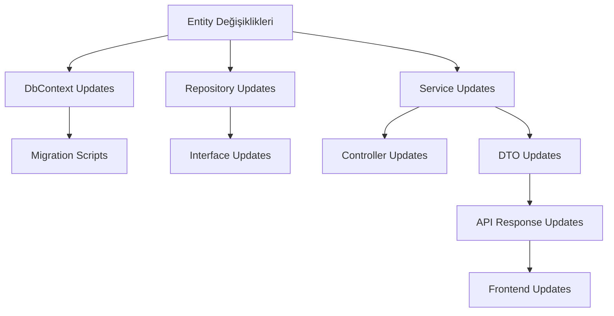

# Entity Yeniden İsimlendirme ve Migrasyon Planı

## 1. Etki Analizi ve Hazırlık

### 1.1 Değişecek Entity'ler ve Yeni İsimleri
| Mevcut İsim | Yeni İsim | Lokasyon |
|-------------|-----------|-----------|
| Firma | Company | Core/Entities/Identity |
| Sube | Branch | Core/Entities/Identity |
| Blok | Block | Core/Entities/Property |
| Daire | Apartment | Core/Entities/Property |
| Rol | Role | Core/Entities/Identity |
| RolYetki | RolePermission | Core/Entities/Identity |
| Yetki | Permission | Core/Entities/Identity |
| KullaniciRol | UserRole | Core/Entities/Identity |
| Kullanici | User | Core/Entities/Identity |

### 1.2 Bağımlılık Analizi


## 2. Değişiklik Öncesi Kontrol Listesi

### 2.1 Kod Tabanı Analizi
```bash
# Her entity için yapılacak aramalar
grep -r "Firma" .
grep -r "IFirmaRepository" .
grep -r "FirmaService" .
grep -r "FirmaController" .
# ... diğer entity'ler için tekrarla
```

### 2.2 Veritabanı Yedekleme
```sql
-- Yedekleme scripti
BACKUP DATABASE ResidenceManagement 
TO DISK = 'D:\Backups\ResidenceManagement_PreRename.bak'
WITH FORMAT, COMPRESSION;
```

## 3. Değişiklik Planı

### 3.1 Faz 1: Entity Katmanı Güncellemesi

1. **Base Entity'ler**
```markdown
- [ ] BaseEntity güncelleme
- [ ] BaseLookupEntity güncelleme
- [ ] BaseTransactionEntity güncelleme
- [ ] ITenant interface güncelleme
```

2. **Core Entity'ler**
```markdown
- [ ] Company.cs oluştur
- [ ] Branch.cs oluştur
- [ ] Block.cs oluştur
- [ ] Apartment.cs oluştur
- [ ] Role.cs oluştur
- [ ] RolePermission.cs oluştur
- [ ] Permission.cs oluştur
- [ ] UserRole.cs oluştur
- [ ] User.cs oluştur
```

### 3.2 Faz 2: Infrastructure Katmanı Güncellemesi

1. **DbContext Güncellemesi**
```csharp
public class AppDbContext : DbContext
{
    // Eski
    public DbSet<Firma> Firmalar { get; set; }
    // Yeni
    public DbSet<Company> Companies { get; set; }
    
    protected override void OnModelCreating(ModelBuilder modelBuilder)
    {
        // Tablo ismi mapping'leri
        modelBuilder.Entity<Company>().ToTable("Companies");
        // ...
    }
}
```

2. **Repository Güncellemesi**
```markdown
- [ ] ICompanyRepository interface
- [ ] CompanyRepository implementation
- [ ] IBranchRepository interface
- [ ] BranchRepository implementation
- [ ] ... diğer repository'ler
```

### 3.3 Faz 3: Application Katmanı Güncellemesi

1. **Service Interfaces**
```markdown
- [ ] ICompanyService
- [ ] IBranchService
- [ ] IBlockService
- [ ] IApartmentService
- [ ] ... diğer servisler
```

2. **Service Implementations**
```markdown
- [ ] CompanyService
- [ ] BranchService
- [ ] BlockService
- [ ] ApartmentService
- [ ] ... diğer servisler
```

3. **DTO Updates**
```markdown
- [ ] CompanyDto
- [ ] BranchDto
- [ ] BlockDto
- [ ] ApartmentDto
- [ ] ... diğer DTO'lar
```

### 3.4 Faz 4: API Katmanı Güncellemesi

1. **Controller Updates**
```markdown
- [ ] CompanyController
- [ ] BranchController
- [ ] BlockController
- [ ] ApartmentController
- [ ] ... diğer controller'lar
```

2. **API Response Updates**
```markdown
- [ ] ApiResponse<CompanyDto>
- [ ] ApiResponse<BranchDto>
- [ ] ... diğer response tipleri
```

### 3.5 Faz 5: Migration İşlemleri

1. **Veritabanı Migration Script'i**
```sql
-- Örnek migration script
BEGIN TRANSACTION;

-- Tablo yeniden isimlendirme
EXEC sp_rename 'Firmalar', 'Companies';
EXEC sp_rename 'Subeler', 'Branches';
-- ... diğer tablolar

-- Foreign key constraint güncelleme
ALTER TABLE [Branches] DROP CONSTRAINT [FK_Subeler_Firmalar];
ALTER TABLE [Branches] ADD CONSTRAINT [FK_Branches_Companies] 
    FOREIGN KEY ([CompanyId]) REFERENCES [Companies]([Id]);
-- ... diğer constraint'ler

COMMIT TRANSACTION;
```

2. **Data Migration Kontrolleri**
```sql
-- Veri kontrolü
SELECT COUNT(*) FROM Companies;
SELECT COUNT(*) FROM Branches;
-- ... diğer tablolar için kontroller
```

### 3.6 Faz 6: Frontend Güncellemesi

1. **API İstek Güncellemeleri**
```typescript
// Eski
interface FirmaDto { ... }
// Yeni
interface CompanyDto { ... }

// API endpoint güncellemeleri
const API_ENDPOINTS = {
    COMPANIES: '/api/companies',
    BRANCHES: '/api/branches',
    // ...
};
```

2. **Component Güncellemeleri**
```markdown
- [ ] CompanyList component
- [ ] BranchList component
- [ ] BlockList component
- [ ] ApartmentList component
- [ ] ... diğer component'ler
```

## 4. Test Stratejisi

### 4.1 Unit Testler
```markdown
- [ ] Company entity testleri
- [ ] Branch entity testleri
- [ ] Company-Branch ilişki testleri
- [ ] ... diğer entity testleri
```

### 4.2 Integration Testler
```markdown
- [ ] Company CRUD operasyonları
- [ ] Branch CRUD operasyonları
- [ ] Multi-tenant senaryoları
- [ ] ... diğer integration testleri
```

### 4.3 E2E Testler
```markdown
- [ ] Company yönetimi akışı
- [ ] Branch yönetimi akışı
- [ ] Kullanıcı yetkilendirme akışı
- [ ] ... diğer E2E testleri
```

## 5. Rollback Planı

### 5.1 Kod Rollback
```markdown
- [ ] Entity değişikliklerini geri alma
- [ ] Migration'ları geri alma
- [ ] Service ve controller değişikliklerini geri alma
```

### 5.2 Veritabanı Rollback
```sql
-- Veritabanı restore scripti
RESTORE DATABASE ResidenceManagement 
FROM DISK = 'D:\Backups\ResidenceManagement_PreRename.bak'
WITH REPLACE;
```

## 6. Deployment Planı

### 6.1 Staging Deployment
1. Veritabanı yedekleme
2. Migration script'lerini çalıştırma
3. Yeni kod versiyonunu deploy etme
4. Smoke testleri çalıştırma

### 6.2 Production Deployment
1. Maintenance mode aktifleştirme
2. Veritabanı yedekleme
3. Migration script'lerini çalıştırma
4. Yeni kod versiyonunu deploy etme
5. Smoke testleri çalıştırma
6. Maintenance mode deaktive etme

## 7. Başarı Kriterleri

### 7.1 Teknik Kriterler
- Tüm testlerin başarılı çalışması
- Veritabanı tutarlılığının korunması
- API response sürelerinin kabul edilebilir seviyede olması

### 7.2 İş Kriterleri
- Kullanıcı işlemlerinin kesintisiz devam etmesi
- Veri kaybı olmaması
- Raporlamaların doğru çalışması

## 8. Zaman Planı

### 8.1 Hazırlık (1 Hafta)
- Detaylı etki analizi
- Test ortamı hazırlığı
- Backup stratejisi

### 8.2 Geliştirme (2 Hafta)
- Entity güncellemeleri
- Migration script'leri
- Service ve controller güncellemeleri

### 8.3 Test (1 Hafta)
- Unit test
- Integration test
- E2E test

### 8.4 Deployment (2-3 Gün)
- Staging deployment
- Production deployment
- Post-deployment kontroller

## 9. İzleme ve Raporlama

### 9.1 Performans Metrikleri
- API response süreleri
- Veritabanı query süreleri
- Error rate

### 9.2 Hata İzleme
- Exception logging
- SQL error logging
- API error logging

Bu plan, tüm değişikliklerin sistematik ve güvenli bir şekilde yapılmasını sağlayacaktır. Her aşama sonrası kontroller yapılmalı ve bir sonraki aşamaya geçmeden önce onay alınmalıdır. 